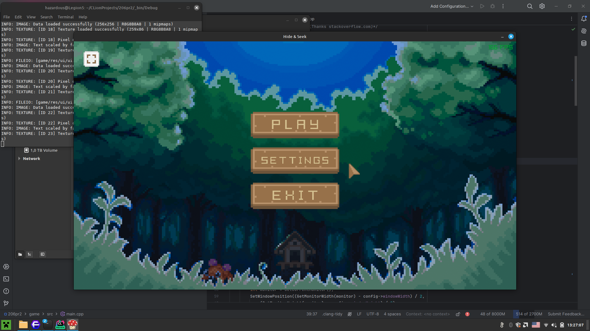
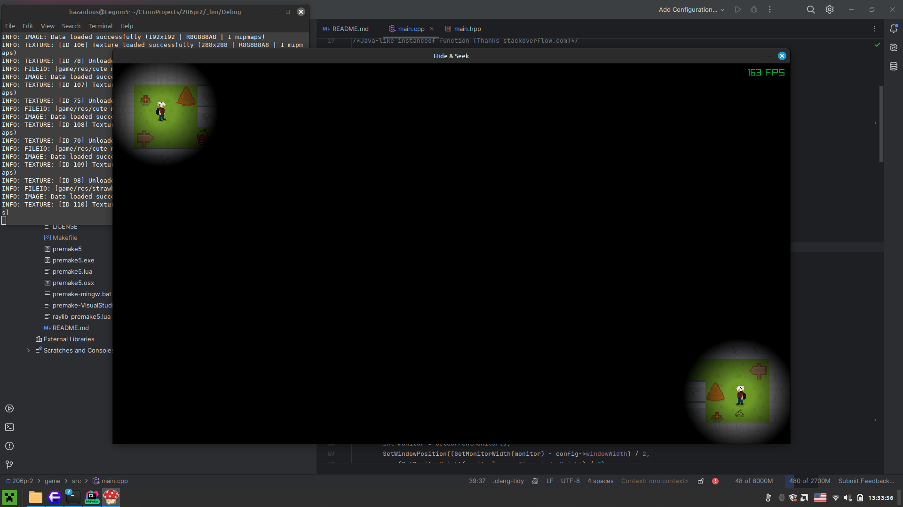
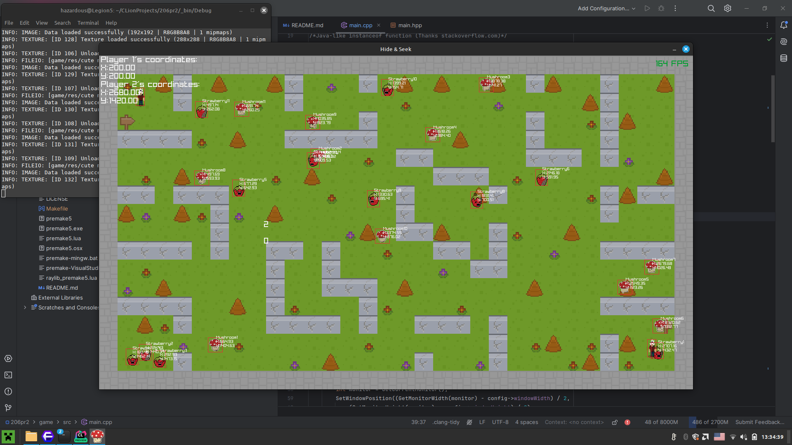

# Screenshots
Splash Screen

Settings

Game

Debug/Godmode

# Generate Projects
For windows users, there are two batch files you can use depending on what compiler you are using. For linux users you can simply use a terminal.
Only do ONE of these options depending on your compiler and platform.
## Windows Users
Visual Studio users should run

    premake-VisualStudio.bat
	
This will generate a Visual Studio project, by default this is configured to work with Visual Studio 2022 but if you have a different version then
edit the batch file and change it to the version of Visual Studio you are using.
	
## MinGW-w64 Users
Please make sure you have a recent version of MinGW-W64. The older versions from mingw.org will not work.
We recommend the W64Devkit. you can download that from here https://github.com/skeeto/w64devkit/releases

Once you have MinGW-W64
Run the batch file.

    premake-mingw.bat

This will generate a makefile for you
	
## Linux users
cd to the game folder and run

    ./premake5 gmake2

This will generate a makefile for you.

## macOS users
cd to the game folder and run

    ./premake5.osx gmake2
	
This will generate a makefile for you.

# Build your game
Only do ONE of these options depending on your compiler and platform.
## Windows Users
Double click the .sln file that was generated in the folder. From here you can use the project as normal.
	
## MinGW-w64 Users
Open your compiler terminal (w64devkit if you are using it), change to the game folder and type 

    make
	
This will build your game
	
## Linux/macOS users
Open your terminal, change to the game folder and type.

    make
	
This will build your game.

## Note
The resources folder (res) inside ./game might need to be copied over to the location of the executable and be put in its own game folder to utilize resources properly,
 it will look like the following: ./_bin/Debug or ./_bin/Release will have the game executable and a folder called game which houses the res folder as follows ./_bin/Debug/game/res or ./_bin/Release/game/res
